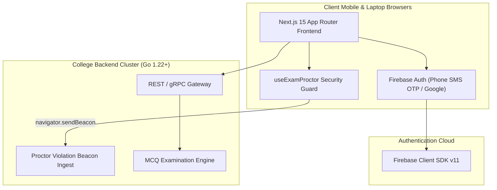

# ARCH_MAP.md — Archify Architectural Manifest & Boundary Contracts

*Generated automatically by Archify Engine on college-webapp*

---

## 1. High-Level Architectural Model (C4 Level 2 Container)

---

## 2. Boundary Invariants & Security Contracts

- **Proctor Security Status:** PASSED (All anti-cheat proctoring invariants verified)
- **Client/Server Isolation:** Zero private server secrets bundled into client code.
- **Beacon Invariant:** Violations dispatched with `sendBeacon` to ensure delivery even during browser close.
- **Split-Screen Invariant:** Dynamic viewport-to-screen ratio `< 0.65` terminates exams instantly.

---

## 3. Discovered Routes & PRD Parity (24 Routes)

| Discovered Route | Module Scope | Rendering Mode |
|---|---|---|
| `/` | Core Academic & Campus Service | Client/Prerendered |
| `/academics` | Core Academic & Campus Service | Client/Prerendered |
| `/attendance` | Core Academic & Campus Service | Client/Prerendered |
| `/bus` | Core Academic & Campus Service | Client/Prerendered |
| `/canteen` | Core Academic & Campus Service | Client/Prerendered |
| `/clubs` | Core Academic & Campus Service | Client/Prerendered |
| `/diary` | Core Academic & Campus Service | Client/Prerendered |
| `/exams` | Core Academic & Campus Service | Client/Prerendered |
| `/exams/[id]` | Core Academic & Campus Service | Client/Prerendered |
| `/exams/terminated` | Core Academic & Campus Service | Client/Prerendered |
| `/faculty` | Core Academic & Campus Service | Client/Prerendered |
| `/fees` | Core Academic & Campus Service | Client/Prerendered |
| `/hallpass` | Core Academic & Campus Service | Client/Prerendered |
| `/health` | Core Academic & Campus Service | Client/Prerendered |
| `/helpdesk` | Core Academic & Campus Service | Client/Prerendered |
| `/labs` | Core Academic & Campus Service | Client/Prerendered |
| `/library` | Core Academic & Campus Service | Client/Prerendered |
| `/login` | Core Academic & Campus Service | Client/Prerendered |
| `/lostfound` | Core Academic & Campus Service | Client/Prerendered |
| `/merits` | Core Academic & Campus Service | Client/Prerendered |
| `/notices` | Core Academic & Campus Service | Client/Prerendered |
| `/placements` | Core Academic & Campus Service | Client/Prerendered |
| `/results` | Core Academic & Campus Service | Client/Prerendered |
| `/timetable` | Core Academic & Campus Service | Client/Prerendered |

---

## 4. Discovered Component Inventory (7 Components)

`AreaChart`, `CrispNavbar`, `ExamProctorHUD`, `InstitutionalFooter`, `MindmapVisualizer`, `StudentTodoList`, `WatermarkOverlay`

---

## 5. Active Hooks & Protocols (1 Hooks)

`useExamProctor`
